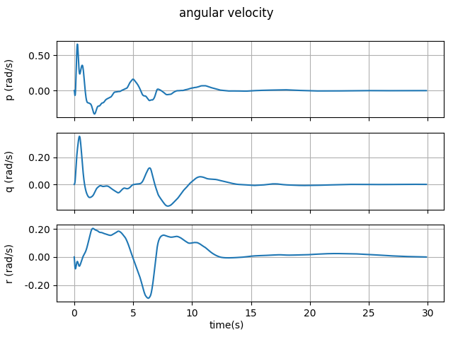

# **Hover**
The first task of DynaG-Heli is hovering. Hover is an flight condition where the aircraft maintains its position on the target position by zeroing angular velocity ($\boldsymbol{\omega}$) and velocity ($\boldsymbol{v}^B$). Moreover, the helicopter is expected to move from start position to the target position. Start and target position is adjusted at the beginning of the episode randomly. Also, at each reset, total mass and center of gravity locations are initialized randomly. Thereby, along with turbulence, the agent is expected to have robustness against them during learning process. 

 

## **Observations**
Velocity on earth frame ($\boldsymbol{v}^E$), Euler angles $(\phi,\theta,\psi)$ , angular velocity ($\boldsymbol{\omega}$), target point error on earth frame ($\Delta \boldsymbol{x}$), ground altitude ($h_{gr}$) and swash-plate angles ($\boldsymbol{\delta}$) are used as observations to policy model. All the observations are normalized values.

 

## **Reward Function**
$$\frac{R}{\Delta t} = 1 - 
\frac{\| \boldsymbol{\omega} \|_2}{\omega_{w}} - 
\frac{\| \boldsymbol{\dot{\delta}} \|_2}{\dot{\delta}_{w}} - 
\min \Bigg( 
\frac{\| \boldsymbol{\Delta x} \|_2}{x_{w}},
\left| 1 - \frac{\boldsymbol{V}^E \cdot \boldsymbol{e}_E^T}{V_{w}} \right|
\Bigg) - 
\frac{\| \boldsymbol{V}^E - \boldsymbol{e}_E^T(\boldsymbol{V}^E \cdot \boldsymbol{e}_E^T) \|_2}{V_{w}^{'}} - 
f.$$

Each sub-reward is a cost of hover constraint. There are five different costs which are angular velocity, swash rate, position, velocity and failure costs. Once all of them are equal the zero, maximum reward becomes $1$ for a single second. To make it so, it is defined by ratio to time step $\Delta t$. 

Some parameters in reward function :

| $\omega_{w}$   | $\dot{\delta}_{w}$ | $x_{w}$    | $V_{w}$     | $V_{w}^{'}$ |
| ------------   | ------------------ | -------    | -------     | ----------- |   
| $6.93 {rad/s}$ | $10 {rad/s}$       | $213 {ft}$ | $30 {ft/s}$ | $75 {ft/s}$ |

**these parameters can be changeable*

 

Example trained results with the corresponding reward functions.

